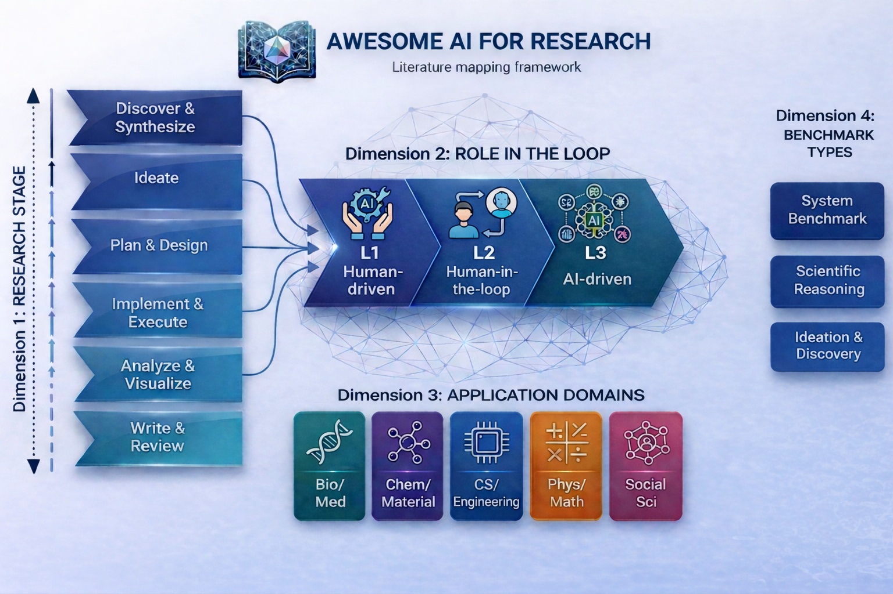

<!-- This file is generated by tooling/build.py. Do not edit directly. -->

<h1 align="center">Awesome AI for Research</h1>

<p align="center">
<a href="https://awesome.re"></a> <a href="LICENSE"></a>     
</p>

<p align="center">
  <em><nobr>"Civilization advances by extending the number of important operations which we can perform without thinking about them." &mdash; Alfred North Whitehead</nobr></em>
</p>

<p align="center">
  <strong>Use AI to improve research efficiency and expand the space of exploration.</strong><br />
  <strong>From focused tools to agents that participate in and reshape the research pipeline.</strong>
</p>

> This repository focuses on recent, high-signal work on AI-driven research itself: systems that participate in the research loop, optimize it, or redefine who drives the loop.

<p align="center">
<a href="#start-here">Start Here</a> · <a href="#by-research-stage">By Research Stage</a> · <a href="#by-role">By Role</a> · <a href="#by-section">By Section</a> · <a href="#by-domain">By Domain</a> · <a href="#benchmarks">Benchmarks</a> · <a href="#taxonomy">Taxonomy</a> · <a href="#contributing">Contributing</a>
</p>


---

<a id="start-here"></a>
## 🚀 Start Here

1. **If you care about AI for Research systems**  
   Start with [End-to-End Research Systems](docs/sections/end-to-end-research-systems.md) and [Benchmarks & Evaluation](docs/benchmarks/index.md) to compare what representative AI-for-research systems actually cover and how they are evaluated.

2. **If you care about AI for Research in a vertical domain**  
   Start with [By Domain](docs/views/by-domain.md), then move to the relevant section pages and [Benchmarks & Evaluation](docs/benchmarks/index.md) for the systems and evaluation anchors that matter in that discipline.

3. **If you care about self-evolving systems**  
   Start with [Self-Evolving Systems](docs/views/self-evolving.md), then use [Experimentation & Agent Methods](docs/sections/experimentation-agent-methods.md) to compare explicit self-improvement loops, experiment-improve systems, and reusable agent methods.

---

<a id="featured-works"></a>
## 🌟 Featured Works

Representative papers and systems that give a fast first read on the current AI4Research landscape.

- **[Autoresearch](docs/catalog.md#autoresearch) (2026) `Experimentation & Agent Methods` `L3`**
  A self-improving AI research repo where agents iteratively rewrite a small training stack, run short experiments, and keep better variants. [Repo](https://github.com/karpathy/autoresearch)
- **[Learning to Discover at Test Time](docs/catalog.md#ttt-discover) (2026) `Experimentation & Agent Methods` `L3`**
  A test-time training system that uses reinforcement learning on a single target problem so the model can keep improving while searching for stronger scientific and algorithmic solutions. [Paper](https://doi.org/10.48550/arXiv.2601.16175) · [Project](https://test-time-training.github.io/discover/)
- **[AlphaEvolve](docs/catalog.md#alphaevolve) (2025) `Experimentation & Agent Methods` `L3`**
  A Gemini-powered evolutionary coding agent for discovering better algorithms and scientific solutions through repeated proposal, execution, and selection. [Paper](https://arxiv.org/abs/2506.13131) · [Blog](https://deepmind.google/discover/blog/alphaevolve-a-gemini-powered-coding-agent-for-designing-advanced-algorithms/)
- **[AI co-scientist](docs/catalog.md#ai-co-scientist) (2025) `Research Ideation` `L2`**
  A Gemini-based multi-agent collaborator for generating literature-grounded hypotheses, overviews, and experimental protocols. [Paper](https://arxiv.org/abs/2502.18864) · [Blog](https://blog.google/feed/google-research-ai-co-scientist/)
- **[Can LLMs Generate Novel Research Ideas?](docs/catalog.md#can-llms-generate-novel-research-ideas) (2024) `Research Ideation` `L1`**
  A large-scale blind human study comparing LLM-generated and expert-generated NLP ideas, with LLM ideas rated higher on novelty but slightly lower on feasibility. [Paper](https://arxiv.org/abs/2409.04109) · [Project](https://saltlab.stanford.edu/papers/si-research-idea-2025/)
- **[The AI Scientist](docs/catalog.md#the-ai-scientist) (2024) `End-to-End Research Systems` `L3`**
  A full-loop AI scientist for idea generation, code writing, experimentation, paper drafting, and simulated review. [Paper](https://doi.org/10.48550/arXiv.2408.06292) · [Repo](https://github.com/SakanaAI/AI-Scientist)
- **[AlphaFold 3](docs/catalog.md#alphafold-3) (2024) `Experimentation & Agent Methods` `L1`**
  A biomolecular structure and interaction prediction system that extends AlphaFold from protein folding to complexes involving proteins, nucleic acids, ligands, and ions. [Paper](https://doi.org/10.1038/s41586-024-07487-w) · [Repo](https://github.com/google-deepmind/alphafold3) · [Project](https://alphafoldserver.com/welcome)


---

<a id="by-research-stage"></a>
## 🧭 Browse by Research Stage

Use this view when you want to find systems by the stage of research they most clearly serve.

[`Discover & Synthesize · 14`](docs/views/by-research-stage.md#discover-synthesize) · [`Ideate · 19`](docs/views/by-research-stage.md#ideate) · [`Plan & Design · 4`](docs/views/by-research-stage.md#plan-design) · [`Implement · 14`](docs/views/by-research-stage.md#implement)  
[`Execute & Experiment · 32`](docs/views/by-research-stage.md#execute-experiment) · [`Analyze & Visualize · 9`](docs/views/by-research-stage.md#analyze-visualize) · [`Write & Review · 13`](docs/views/by-research-stage.md#write-review)


---

<a id="by-role"></a>
## 🪜 Browse by Role

This ladder separates human-driven tools, human-in-the-loop collaborators, and AI-driven systems.

1. [`L1 Tools · 25`](docs/views/by-intelligence-level.md#l1-tools) - Human drives the loop. The AI acts as a tool, local component, or narrow assistant rather than as a workflow owner.
2. [`L2 Collaborators · 30`](docs/views/by-intelligence-level.md#l2-collaborators) - Human in the loop. The AI can advance multi-step work, but humans still steer, gate, or validate important decisions.
3. [`L3 Systems · 39`](docs/views/by-intelligence-level.md#l3-systems) - AI drives the loop. The system owns substantial execution and iteration, while humans mainly provide goals, constraints, or downstream review.


---

<a id="by-section"></a>
## 📚 Browse by Section

| Section | Focus | Count |
| --- | --- | --- |
| [🔬 End-to-End Research Systems](docs/sections/end-to-end-research-systems.md#end-to-end-research-systems) | Systems that cover multiple core stages of the research process and aim to complete a relatively full research loop with limited human intervention. | 14 |
| [⚙️ Experimentation & Agent Methods](docs/sections/experimentation-agent-methods.md#experimentation-agent-methods) | Systems, methods, and specialized agents whose main contribution is iterative experimentation, optimization, search, reflection, or self-improving execution, rather than a full end-to-end research workflow. | 42 |
| [💡 Research Ideation](docs/sections/research-ideation.md#research-ideation) | Systems focused on generating research questions, hypotheses, directions, or project ideas. | 14 |
| [📚 Literature Discovery & Synthesis](docs/sections/literature-discovery-synthesis.md#literature-discovery-synthesis) | Systems focused on finding, organizing, comparing, and synthesizing prior work. | 5 |
| [📝 Survey / Review Automation](docs/sections/survey-review-automation.md#survey-review-automation) | Systems designed to produce structured surveys, reviews, or systematic review-style outputs. | 10 |
| [🧱 Research Infrastructure & Frameworks](docs/sections/research-infrastructure-frameworks.md#research-infrastructure-frameworks) | Frameworks, platforms, runtimes, and engineering environments for building and operating research agents. | 9 |
| [📏 Benchmarks & Evaluation](docs/benchmarks/index.md#benchmarks-evaluation) | Benchmarks, datasets, metrics, and evaluation frameworks for research agents and AI-for-research systems. | 16 |


---

<a id="by-domain"></a>
## 🧪 Browse by Application Domain

Use this view when you want to find systems through the disciplines where they are being applied, rather than through research stage or role in the loop.

| Domain | Focus | Count |
| --- | --- | --- |
| [Artificial Intelligence](docs/views/by-domain.md#ai) | Applications in artificial intelligence research, machine learning research workflows, and AI-for-AI systems with explicit AI research targets or evaluation. | 48 |
| [Biomedical](docs/views/by-domain.md#biomedical) | Applications in biology, medicine, drug discovery, and biomedical literature. | 4 |
| [Chemistry](docs/views/by-domain.md#chemistry) | Applications in chemical reasoning, synthesis, and molecular discovery. | 2 |
| [Computer Science](docs/views/by-domain.md#computer-science) | Applications in non-AI computer science research such as formal methods, programming systems, and algorithmic reasoning. | 4 |
| [General](docs/views/by-domain.md#general) | Cross-domain or discipline-agnostic systems for AI-driven research workflows, literature work, agent infrastructure, and research methodology that are not clearly anchored to one vertical field. | 30 |
| [Materials Science](docs/views/by-domain.md#materials-science) | Applications in materials discovery, materials property reasoning, and experimental design. | 2 |
| [Math](docs/views/by-domain.md#math) | Applications in mathematical reasoning, theorem proving, and formal proof discovery. | 3 |
| [Physics](docs/views/by-domain.md#physics) | Applications in physical science reasoning, modeling, and scientific analysis. | 2 |
| [Social Science](docs/views/by-domain.md#social-science) | Applications in social simulation, policy analysis, behavioral science, and computational social experiments. | 2 |


---

<a id="benchmarks"></a>
## 📏 Benchmarks & Evaluation

Benchmarks are a core surface of this repository rather than an appendix. They make it easier to separate promising demos from systems that are tested on realistic scientific or AI-research workloads.

The main benchmark hub lives at [docs/benchmarks/index.md](docs/benchmarks/index.md).

### Highlighted benchmark anchors

- **[FrontierScience](docs/catalog.md#frontierscience)** (2025) · `Scientific Reasoning`
  An expert-written benchmark for Olympiad-style and research-style scientific reasoning across physics, chemistry, and biology.
- **[Scientist-Bench](docs/catalog.md#scientist-bench)** (2025) · `System Benchmark` · `Ideation & Discovery`
  A benchmark surface introduced alongside AI-Researcher for assessing guided and open-ended autonomous AI research.
- **[MLE-Bench](docs/catalog.md#mle-bench)** (2024) · `System Benchmark`
  A benchmark built from Kaggle competitions to measure how well AI agents perform at machine learning engineering.
- **[ScienceAgentBench](docs/catalog.md#scienceagentbench)** (2024) · `System Benchmark` · `Scientific Reasoning`
  A task-level benchmark for evaluating language agents on authentic data-driven scientific discovery problems.

### Benchmark types

- `System Benchmark` - Measures end-to-end AI research systems or realistic multi-step workflows.
- `Scientific Reasoning` - Measures scientific problem solving, expert analysis, or domain reasoning quality.
- `Ideation & Discovery` - Measures hypothesis generation, novelty, or open-ended scientific discovery quality.


---

<a id="taxonomy"></a>
## 🗂 Taxonomy

The repository uses a lightweight taxonomy so entries can be read through research stage, role in the loop, application domain, and evidence quality without turning the README into a flat list.



- [Research stage taxonomy](docs/taxonomy.md#research-stage-taxonomy) for the macro stage map and fine-grained stage legend.
- [Role taxonomy](docs/taxonomy.md#role-taxonomy) for the L1 to L3 human-tool-system ladder, with `self-evolving` tracked as a tag.
- [Application domain taxonomy](docs/taxonomy.md#application-domain-taxonomy) for discipline-oriented navigation across artificial intelligence, biomedical, chemistry, computer science, general, materials science, math, physics, and social science.
- [Benchmark taxonomy](docs/taxonomy.md#benchmark-taxonomy) for the compressed evaluation vocabulary used across benchmark pages.
- [Evidence taxonomy](docs/taxonomy.md#evidence-level-taxonomy) for how we interpret evidence strength across papers, reports, benchmarks, and repositories.

---

<a id="citation"></a>
## Citation

If you find this repository useful in your research, please cite:

```bibtex
@misc{awesome_ai_for_research_2026,
  author       = {Jing, Yi and Xin, Amy and Yao, Zijun},
  title        = {Awesome AI for Research},
  year         = {2026},
  howpublished = {\url{https://github.com/THU-KEG/Awesome-AI-for-Research}},
  note         = {GitHub repository}
}
```


---

<a id="contributing"></a>
## 🤝 Contributing

This repository is curated, and contributions are welcome when they improve the source data.

The most helpful contributions are:
- adding a new entry
- correcting links or metadata for an existing entry

Please keep the scope narrow: recent, high-signal AI4Research systems over historical completeness.

When contributing:
- prefer primary sources for papers, repositories, benchmark pages, and project sites
- edit the source data rather than generated Markdown pages
- leave featured selections, taxonomy files, and templates unchanged unless a broader change is clearly necessary
- regenerate the repository with `python3 tooling/build.py` before submitting a pull request


---

<p align="center">
 <a href="https://github.com/LeoJ-xy"></a> <a href="https://github.com/APopCycle"></a> <a href="https://github.com/TranSirius"></a>
</p>
